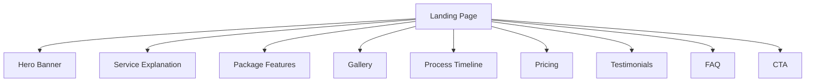
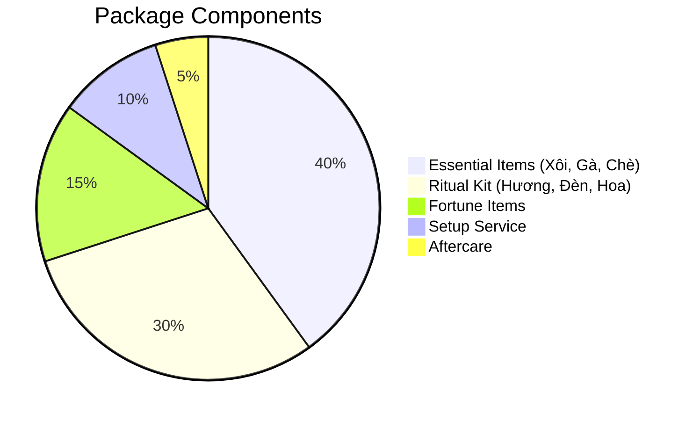

# Mâm Cúng Đầy Tháng/Thôi Nôi Landing Page Structure



## 1. Hero Banner
**Visual Elements**
- Full-width image of traditional arrangement
- Overlay with gradient (red/gold colors)

**Copy Elements**
```text
Chuẩn Bị Mâm Cúng Chuyên Nghiệp
Đảm bảo đủ lễ vật - Giao tận nơi - Đúng phong tục

[ĐẶT NGAY - GIẢM 10%]
```

## 2. Service Explanation
**Cultural Context**
- Importance of first month/year ceremonies
- Regional variations (Bắc/Trung/Nam)

**Value Proposition Table**
| Traditional Preparation | Our Service |
|-------------------------|-------------|
| 3+ hours market time | Giao hàng 2h |
| Risk of missing items | Đủ 25 lễ vật |
| No guidance | Tư vấn miễn phí |

## 3. Package Features


## 4. Gallery
**Content Types**
- Before/After setup comparisons
- Customer ceremony photos
- 360° product views
- Chef preparation videos

## 5. Process Timeline
1. Đặt lịch online (5 phút)
2. Xác nhận qua Zalo
3. Giao hàng tận nơi
4. Setup chuyên nghiệp
5. Thanh toán an toàn

## 6. Pricing Packages
| Gói | Đầy Tháng | Thôi Nôi | Ưu Đãi |
|-----|-----------|----------|--------|
| Basic | 1.990k | 2.490k | Giao chuẩn |
| Premium | 2.990k | 2.990k | +Bàn thờ mini |
| VIP | 4.990k | 5.490k | +Photographer |

## 7. Testimonials
**Social Proof Elements**
- 4.9/5 sao (300+ đánh giá)
- Video phản hồi khách hàng
- Hình ảnh chứng nhận ATVSTP
- Đối tác uy tín (Vietcombank, Sacombank)

## 8. FAQ
**Common Questions**
- Q: Thời gian đặt trước?  
  A: Ít nhất 48 giờ

- Q: Thanh toán thế nào?  
  A: COD hoặc chuyển khoản

- Q: Có hợp đồng không?  
  A: Có xác nhận đơn hàng

## 9. CTA Section
**Conversion Elements**
- Hotline/Zalo: 0909.XXX.XXX
- Form nhận báo giá
- Map 3 chi nhánh (Q.1, Q.7, Thủ Đức)
- Giờ làm việc: 7h-21h hàng ngày